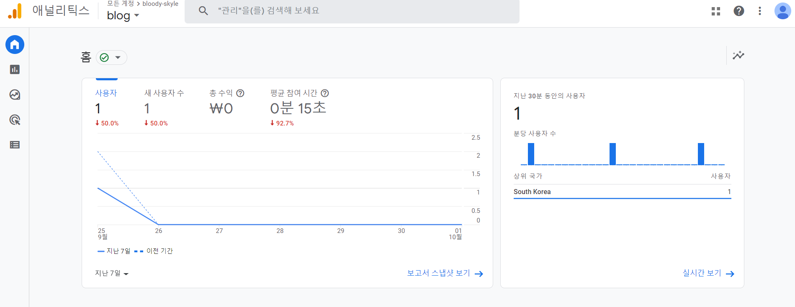

일단 google analytics라고 검색한다.  
그리고 들어가서 뭐 어떻게이렇게저렇게 잘 하면 뭐 어떻게 자기 웹사이트가 뭐 어떻게 되는데 이제 사용자 수를 확인하려면 여기 vs코드에다가 코드를 넣어줘야한다.  

쌤은 이 코드를 default.html에 아래에 있는 `<body>`아래에 넣었다.

```
<!-- Global site tag (gtag.js) - Google Analytics -->
<script async src="https://www.googletagmanager.com/gtag/js?id=(여기다가그어딘가에서찾은ID를넣으면된다.)"></script>
<script>
  window.dataLayer = window.dataLayer || [];
  function gtag(){window.dataLayer.push(arguments);}
  gtag('js', new Date());

  gtag('config', 'GA_MEASUREMENT_ID');
</script>
```
설명을 너무 대충하는거 같지만 어쩔수 없다.  

쌤이 다하고 난 보기만 했으니깐



이렇게 볼수 있다.