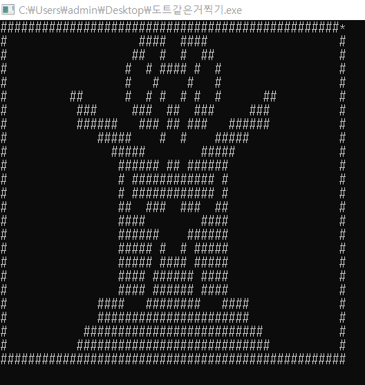

장애물 피하기와 별 다른건 없다.

<h2>ver.1</h2>
```
#include<iostream>
#include<conio.h>
using namespace std;
int main(){
    char w[25][50]={};
    char l[25][50]={};
    int key,i,j;
    int x=0;
    int y=0;
    for(i=0;i<25;i++){
        for(j=0;j<50;j++){
            w[i][j]=' ';
        }
    }
    for(i=0;i<25;i++){
        for(j=0;j<50;j++){
            l[i][j]=' ';
        }
    }
    w[0][0]='*';
    while(1){
        system("cls");
        for(i=0;i<25;i++){
            for(j=0;j<50;j++){
                if(w[i][j]=='*'){
                	cout << w[i][j];
				}
				else{
					cout << l[i][j];
				}
            }
            cout << endl;
        }
        key=getch();
        switch(key){
            case 'w':
                if(y!=0){
                    w[y][x]=' ';
                    y=y-1;
                    w[y][x]='*';
                }
                break;
        	case 's':
				if(y!=24){
        			w[y][x]=' ';
        			y=y+1;
        			w[y][x]='*';
				} 
				break;
			case 'a':
                if(x!=0){
                    w[y][x]=' ';
                    x=x-1;
                    w[y][x]='*';
                }
                break;
        	case 'd':
				if(x!=49){
        			w[y][x]=' ';
        			x=x+1;
        			w[y][x]='*';
				} 
				break;
			case ']':
				l[y][x]='#';
				break;
			case '\\':
				l[y][x]=' ';
				break;
		}
    }
}
```

실행하면 aswd로 움직이고 ]로 도트 찍기, \로 삭제가 가능하다.  

이건 내 작품이다.  
